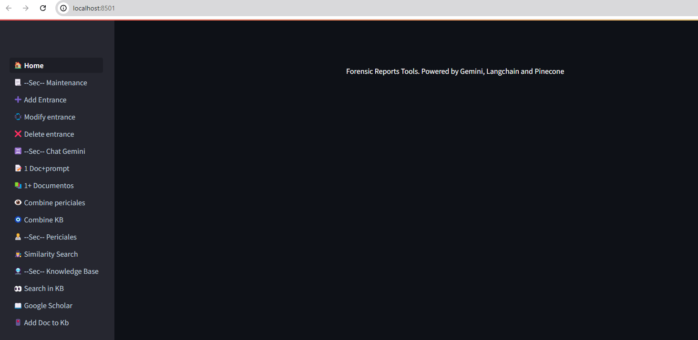

# What is Gemini Fornsic Tool .
Gemini Forensic Tool is an application developed in Python that helps forensic doctors perform their work end to end. Forensic doctors are healthcare professionals specialized in evaluating, investigating, and documenting injuries and causes of death within the context of legal investigations. They work closely with judicial and law enforcement authorities to interpret medical findings that may be relevant in trials and other legal actions. Their responsibilities include conducting autopsies, preparing medico-legal reports, and providing expert testimony in court.

# Techonolgy.

The main techonlogies use in this application are:
- Python 3.11
- GCP Compute Engine / Vertex Ai
- Docker
- Gemini Studio / GCP Vertex Ai SDK,s and Models. Primarily gemini-1.5-pro-001 and models/text-embedding-004
- Langchain
- Pinecone, Chroma and Faiss
- Streamlit

File requirements.txt [here](requirements.txt)

# Description
Home 

Main Sections
- Maintenance [here](docs/maintenance.md) : We can add , modify and delete entries in the tables Propmts, Forensic reports and Gemini Answers.
- Chat Gemini [here](docs/chat_gemini.md): Here we interact with the model:
    - 1 Doc+ Prompt: Here you can use a Document (PDF) and a Prompt (from our table or you can write one) to extract and format the content of the document. We use this option to extract the factual information we got from patients in form or medical reports , prescriptions etc. You Interacts with the llm in a Multimodal Chabot Conversation and refine the answer provided by the model. When you are satisfaced with the answer you can save the answers provided by Gemini or abamdone.
    - 1 + Documents:  Here you can use multiple documents related to a case or any other topic like medical research or law to dialog with the LLM to extract relevant information. You can decide if later apply the answer/extraction to a case or no. Also you can decide if save the conversation or no.
    - Combine periciales: Here you can combine the Gemini Answers you got in the previous two options with past forensic reports. These past forensic reports are kept in a pinecone vectore store colection. You can query the vector Store using Natural Language to find a previous report which suit with the current case you are working on. When you made a search you receive top 5 most similar reports and you can look at their content to decide if that can be use as example. 
    Each report have 5 sections:
        - Background Documents: Facts extracted from Documents.
        - Backgroud Doctor: Analisys Provided by Forensic Doctor after analysis of Background Documents.
        - Current Status: Forensic Doctor Observation of the patient.
        - Medico-Legal Considerations: Medical Regulations and Law Framework that apply to the case.
        - Conclusions: Final conclusion for this case. Usually 3 to 4 bulletpoints as summary for the court.
    - Combine KB: Here you can combine Gemini Answers which are not extracted from case documents (like extracted from medical Research, legislation or other) with Previous Forensic Reports. Same than previous but here we combine the sections with External Information we got either from our Knowledge Base or from a extraction in a conversation with Gemini. ALso posible to add information we get from Pubmed or Google Scholar (This need a refinement).
- Periciales [here](docs/Periciales.md): Here we can query our Forensic vector store and visualize reports sections.
- Knowledge Base [here](docs/KB.md):
    - Search in KB: Here we have created a Knowledge Base from documents. We Initially have upload all legislation and Law that apply to Forensic Medicine into a category, but we can upload documents to other sections. Here you Interact with the model in a conversation and you can decide at the end if to save the whole conversation (only Gemini anwers) or only a part to later use it in combine with your current case.
    - Google Scholar: Here we look for relevant Documents, Research and Information related to Medical Conditions , rare topics, law or anything that the Doctor need to support the case in Google Sholar and Google.
    - Pubmed : Here we do the same than with Google Scholar, but in Pubmed. This section is temporarily hide due to redesing.
    - Add Doc to Kb. Add a new document to a category to the Knowledge Base

# Install the application

- Install in local
    - Clone repository https://github.com/olonok69/gemini-bot.git
    - create a conda eenvironment with python 3.11
    - Install requirements.txt libraries

- Install docker (This is in GCP VM). You need docker desktop installed in this case in Ubuntu 22.04
    - Clone repository https://github.com/olonok69/gemini-bot.git
    - from root folder execute sudo docker build --pull --rm --build-arg user_app=app -f "Dockerfile" -t gemini-bot:latest "."
    - sudo docker compose  -f docker-compose.yml down ("If you are going to install a new version")
    - sudo docker compose  -f docker-compose.yml up -d

# Run Application
python -m stramlit run pages.py

# Logging
We use logging capabilties of GCP to keep track of what happens whith the application.
### docs
https://cloud.google.com/logging/docs
### library
https://pypi.org/project/google-cloud-logging/

# Pendings
    - Authentication and Security
    - Setup workflows