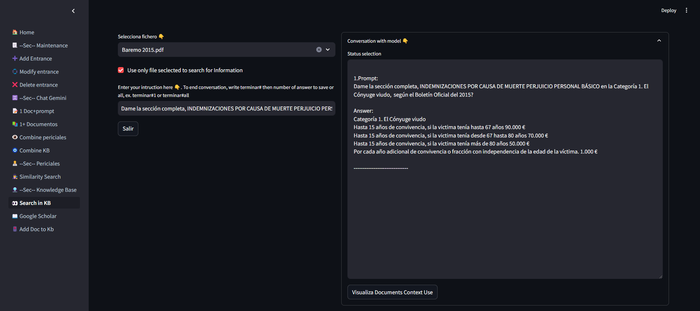
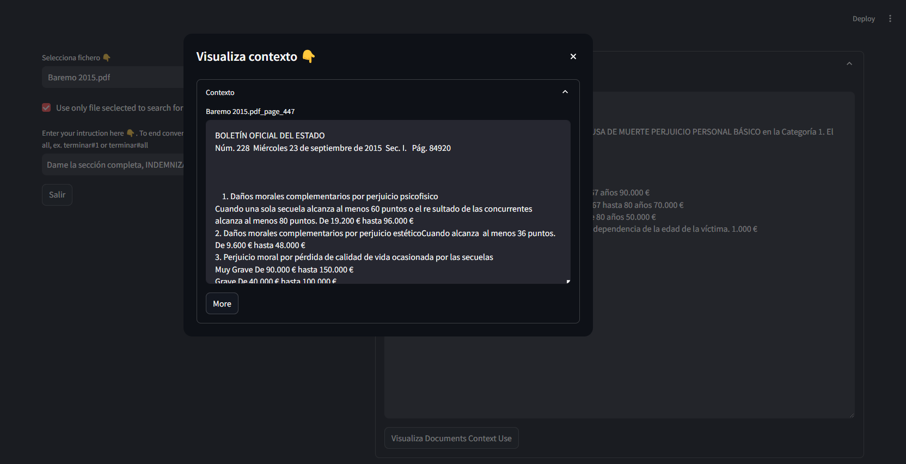
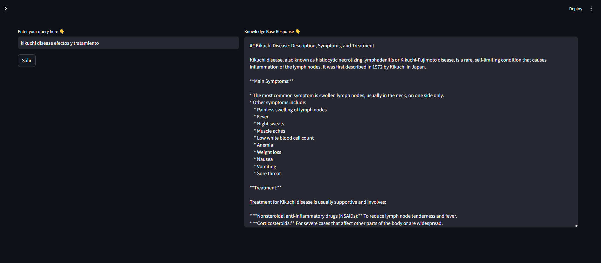
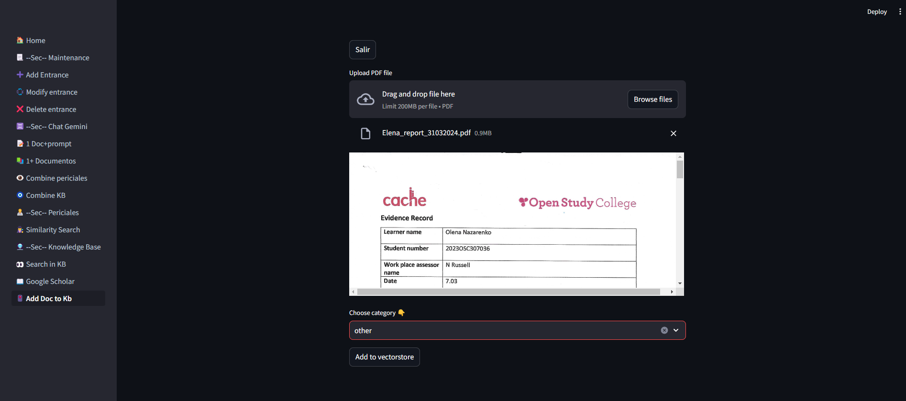

# Knowledge Base
 Here we can query our Knowledge Base, Google Shoolar, Google or Pubmed to find for relevant information to help creationg the Foresnsic Report.

## Search in KB 

Click on Visualiza Documents Context Use

Here we have created a Knowledge Base from documents. We Initially have upload all legislation and Law that apply to Forensic Medicine into a category, but we can upload documents to other sections. Here you Interact with the model in a conversation and you can decide at the end if to save the whole conversation (only Gemini anwers) or only a part to later use it in combine with your current case.

Process

- Select the document name of the document to use on the Search
- Click on the checkbox "Use only file selected..." if you want to close the search only to the document selected above. Otherwise if not selected the app will use the whole KB.
- Write an Instruction and press enter. You start a conversation with the model.
- You will receive an answer in the the expanded combobox text area top right. In the Text area you will see the prompt and the answer.
- You can click in Visualize Document Context Use to see the document that Gemini use to build the anwers.
- You can write another question an press enter or write terminar + # and the number of prompt to save (writting "all" save all the answers) ex: terminar#1 or terminar#all to save the answers in the table no_case_Answers. Also you can click in Salir to finish the process 

## Google Scholar 

Here we look for relevant Documents, Research and Information related to Medical Conditions , rare topics, law or anything that the Doctor need to support the case in Google Sholar and Google.

Process

- Enter the query and press enter. This will start the chain with Gemini and will look for relevant Information in Google Scholar and Google Engine to be use as context and be use by the model to answer your question
- One reviewed the answer either write another query or salir

##  Add Doc to Kb

Here we Add a new document to a category to the Knowledge Base

Process

- Select the file use the component Browse Files.
- The pdf will appears in the Browser and you can explore it. If not what you are looking for, click in the cross and upload a new one.
- Choose category
- Add to vectorstore or click Salir to leave the process