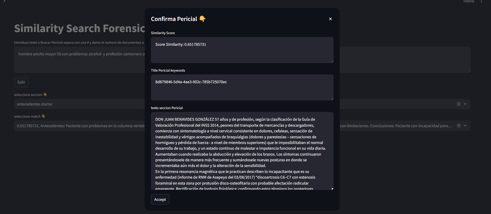

# Seccion Periciales
 Here we can query our Forensic vector store and visualize reports sections.

## Similarity Search

Process

- The write a statement that describe the problem you want to find in the Vector store of previous Forensic reports, follows of # and the number of most closest documents to that statement ex. "Fribromialgia, men , more than 50, driver #5". Press Crtl + Enter
- Select Section of Forensic report you want to use
- Select the match amont of the number of document selected in the selector "selecciona match". A Modal Dialog will appears and you accept of refuse the match. Click on the x to close the dialog and choose another document returned or to start another query.