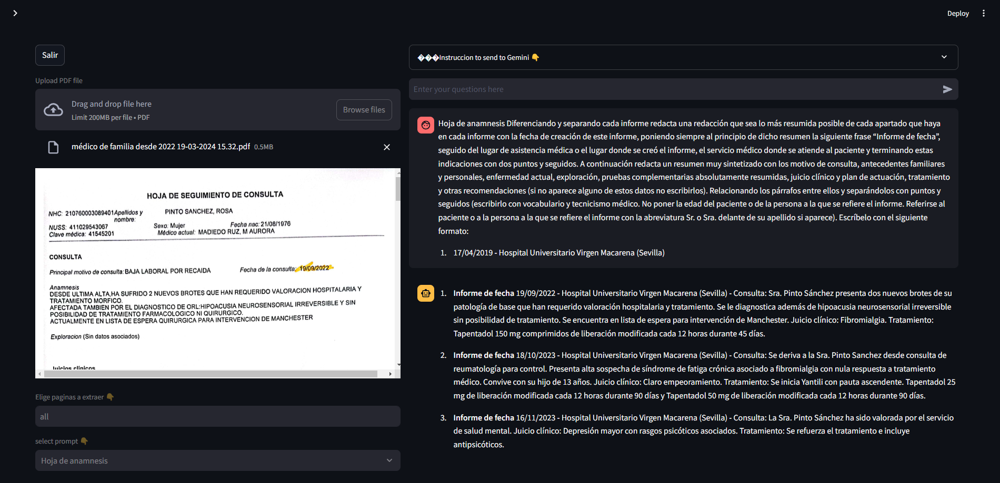
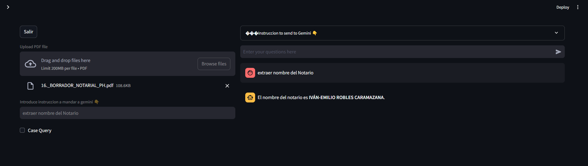
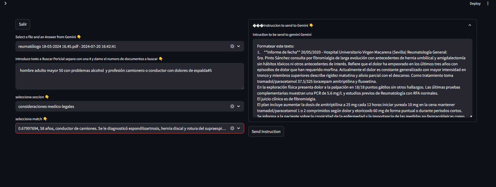
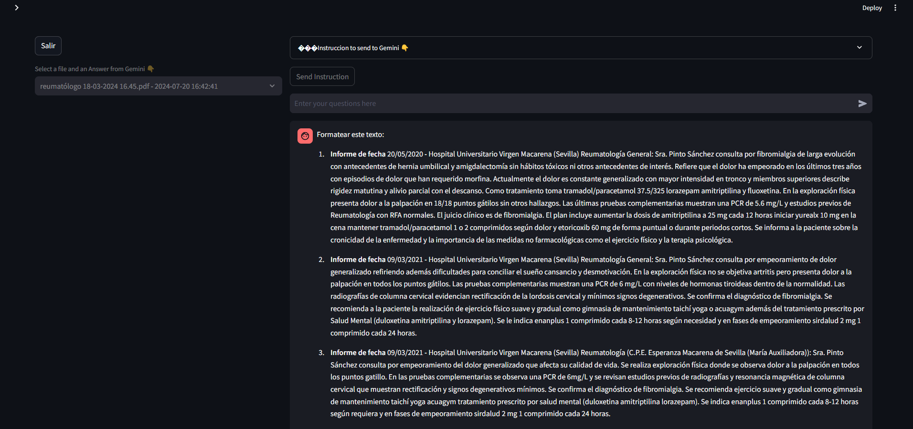
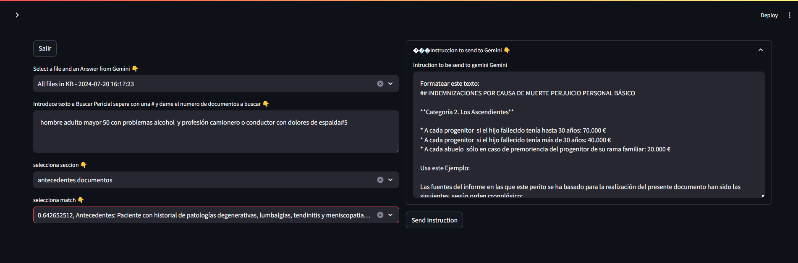
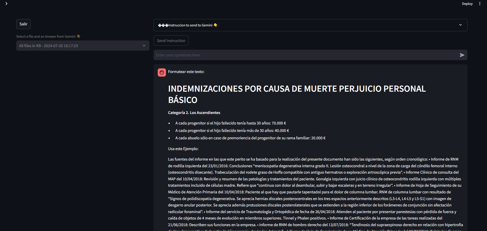

# Seccion Chat Gemini
Here we interact with Gemini in multimodal conversations 

## 1 Doc+Prompt

Here you can use a Document (PDF) and a Prompt (from our table or you can write one) to extract and format the content of the document. We use this option to extract the factual information we got from patients in form or medical reports , prescriptions etc. You Interacts with the llm in a Multimodal Chabot Conversation and refine the answer provided by the model. When you are satisfaced with the answer you can save the answers provided by Gemini or abandone.
- First you upload the document to the Pdf browser.
- Choose the page/s to extract (all use all pages).
- Select the Prompt to use in combination with the model. One you select a prompt it will appears a modal dialog to you visualize the prompt. Then if you want to use it you will need to accept.
- One you accept you can review the Instruction to send to Gemini together with the document into the expanded combobox text area top right.
- Click send to Gemini if you want to start conversation with the Model
- To finish either write terminar in the input Area use to conversate with the model or click Salir. If you write terminar you will save this conversation on the cases asnwers table.

## 1+ Documents

Here you can use multiple documents related to a case or any other topic like medical research or law to dialog with the LLM to extract relevant information. You can decide if later apply the answer/extraction to a case or no. Also you can decide if save the conversation or no.
- First you upload the document to the screen.
- Write the instruction to send to gemini. Here you can write in Natural Language what you want to extract from the document
- Use the CheckBox Case Query if you plant to save this as an Forensic Case anwer.
- You can review the Instruction to send to Gemini together with the document into the expanded combobox text area top right.
- Click send to Gemini if you want to start conversation with the Model.
- To finish either write terminar in the input area use to conversate with the model or click Salir. If you write terminar and the check box "Case Query" is selected,you will save this conversation on the cases asnwers table, otherwise in the table no_case answer table.

## Combine Periciales

After click send buttom

Here you can combine the Gemini Answers you got in the previous two options with past forensic reports. These past forensic reports are kept in a pinecone vectore store colection. You can query the vector Store using Natural Language to find a previous report which suit with the current case you are working on. When you made a search you receive top 5 most similar reports and you can look at their content to decide if that can be use as example. 
    Each report have 5 sections:
        - Background Documents: Facts extracted from Documents.
        - Backgroud Doctor: Analisys Provided by Forensic Doctor after analysis of Background Documents.
        - Current Status: Forensic Doctor Observation of the patient.
        - Medico-Legal Considerations: Medical Regulations and Law Framework that apply to the case.
        - Conclusions: Final conclusion for this case. Usually 3 to 4 bulletpoints as summary for the court.

Process
- Select in the first combo file an Answer from Gemini a recorder past conversation with Gemini. One you get the Modal Dialog, accept or refuse the selection.
- The write a statement that describe the problem you want to find in the Vector store of previous Forensic reports  , follows of # and the number of most closest documents to that statement ex. "Fribromialgia, men , more than 50, driver #5". Press Crtl + Enter
- Select Section of Forensic report you want to use
- Select the match amont of the number of document selected in the selector "selecciona match". A Modal Dialog will appears and you accept of refuse the match. If you accept the button send Intruction will appears.
- You can review the Intruction to send to Gemini in the expanded combobox text area top right. If you are happy with that click Send Instruction.
- To finish either write terminar in the input area use to conversate with the model or click Salir. If you write terminar,you will save this conversation on the final asnwers table.

## Combine KB

After click send buttom

Here you can combine Gemini Answers which are not extracted from case documents (like extracted from medical Research, legislation or other) with Previous Forensic Reports. Same than previous but here we combine the sections with External Information we got either from our Knowledge Base or from a extraction in a conversation with Gemini. ALso posible to add information we get from Pubmed or Google Scholar (This need a refinement).

Process
- Select in the first combo file an Answer from Gemini a recorder past conversation . with Gemini Those you did speaking with the Knowledge Base or free prompt in the option 1+ Document with the checkbox "Case Query" not selected. One you get the Modal Dialog, accept or refuse the selection.
- The write a statement that describe the problem you want to find in the Vector store of previous Forensic reports  , follows of # and the number of most closest documents to that statement ex. "Fribromialgia, men , more than 50, driver #5". Press Crtl + Enter
- Select Section of Forensic report you want to use
- Select the match amont of the number of document selected in the selector "selecciona match". A Modal Dialog will appears and you accept of refuse the match. If you accept the button send Intruction will appears.
- You can review the Intruction to send to Gemini in the expanded combobox text area top right. If you are happy with that click Send Instruction.
- To finish either write terminar in the input area use to conversate with the model or click Salir. If you write terminar,you will save this conversation on the final asnwers table.
